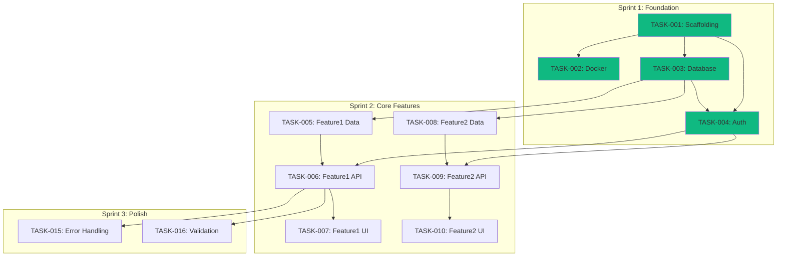

# ProdReady Plan Skill

References to slash commands mean use the corresponding `prodready-*` skill.


Break down the implementation into actionable tasks with dependencies.

**Estimated time**: ~15 minutes

**Prerequisites**: Complete `prodready-design` and pass `prodready-gate design`

## Instructions

Analyze the define and design artifacts to create a detailed implementation plan.

### Prerequisites Check

1. Verify `.prodready/define/` exists with user stories
2. Verify `.prodready/design/` exists with architecture and API spec
3. Create plan directory:
   ```
   .prodready/plan/
   ```

---

## Step 1: Create Implementation Strategy

Read and synthesize:
- User stories from `.prodready/define/requirements/user-stories.md`
- Architecture from `.prodready/design/architecture/pattern.md`
- Tech stack from `.prodready/design/architecture/tech-stack.md`
- API spec from `.prodready/design/api/openapi.yaml`

Generate `.prodready/plan/implementation-plan.md`:

```markdown
# Implementation Plan

## Overview

Project: [Name from vision.md]
Pattern: [From pattern.md]
Stack: [Key technologies]

## Phases

### Phase 1: Foundation (Sprint 1)
**Goal**: Project setup and infrastructure
- Project scaffolding
- Database setup
- Authentication foundation

### Phase 2: Core Features (Sprint 2-3)
**Goal**: Implement MVP features
- [Core feature 1]
- [Core feature 2]
- [Core feature 3]

### Phase 3: Integration (Sprint 4)
**Goal**: Connect and polish
- API integration
- Error handling
- Basic UI polish

## Risks & Mitigations

| Risk | Impact | Mitigation |
|------|--------|------------|
| [Risk 1] | High | [Mitigation] |
| [Risk 2] | Medium | [Mitigation] |

## Dependencies

External dependencies:
- [ ] [Service/API access]
- [ ] [License/account needed]
```

## Step 1.5: Socratic Strategy Review

Before generating the backlog, challenge the phasing with the user:

- **Risk placement**: "Which part of this plan carries the most unknowns — [your best guess]? It's currently scheduled in [phase N]. Shouldn't the scariest thing come first, while there's still time to change course?"
- **Walking skeleton**: "After Phase 1, will anything work end-to-end (one thin slice: UI → API → DB → back)? If not, when is the first moment you'll know the pieces actually fit together?"
- **External dependencies**: for each external dependency: "What happens to the plan if [dependency] isn't available on day 1?"

**Max 2-3 questions, one round.** Adjust the phasing based on answers before writing the backlog.

---

## Step 2: Generate Backlog

Break down each user story into implementation tasks.

### Task Sizing Rules

- Each task should be < 4 hours of work
- Each task should be independently testable
- Each task should produce a commit-worthy change
- Each acceptance criterion must be written as `AC-N: <single, observable, measurable behavior>`
- Each story/task-scoped `AC-N` must produce exactly one canonical acceptance test task before its implementation task

### Task Structure

Generate `.prodready/plan/backlog.md`:

```markdown
# Implementation Backlog

## Sprint 1: Foundation

### TASK-001: Project Scaffolding
**Priority**: P0 | **Estimate**: 2h | **Status**: Ready

**Description**:
Initialize Next.js project with TypeScript, ESLint, Prettier, and base configuration.

**Acceptance Criteria**:
AC-1: Next.js 15 with App Router initialized
AC-2: TypeScript strict mode enabled
AC-3: ESLint + Prettier configured
AC-4: Base folder structure created (src/app, src/lib, src/types)
AC-5: Git initialized with .gitignore

**TDD Tasks**:
- [ ] Write failing canonical test for AC-1
- [ ] Implement AC-1 (red→green)
- [ ] Write failing canonical test for AC-2
- [ ] Implement AC-2 (red→green)
- [ ] Repeat for each remaining AC

**Blocked by**: None
**Blocks**: TASK-002, TASK-003, TASK-004

---

### TASK-002: Docker Setup
**Priority**: P0 | **Estimate**: 2h | **Status**: Ready

**Description**:
Create Docker configuration for development and production.

**Acceptance Criteria**:
AC-1: Dockerfile with multi-stage build (deps/dev/builder/runner)
AC-2: compose.yaml (base) + compose.override.yaml (development)
AC-3: compose.prod.yaml overlay for production
AC-4: .dockerignore configured
AC-5: App runs in container

**Blocked by**: TASK-001
**Blocks**: None

---

### TASK-003: Database Setup
**Priority**: P0 | **Estimate**: 2h | **Status**: Ready

**Description**:
Configure PostgreSQL with Prisma ORM.

**Acceptance Criteria**:
AC-1: PostgreSQL in docker compose
AC-2: Schema from .prodready/define/data-model/schema.* applied
AC-3: Initial migration created
AC-4: Database connection working
AC-5: Seed file created

**Blocked by**: TASK-001
**Blocks**: TASK-005

---

### TASK-004: Authentication Setup
**Priority**: P0 | **Estimate**: 3h | **Status**: Ready

**Description**:
Implement user authentication system.

**Acceptance Criteria**:
AC-1: User model in Prisma schema
AC-2: Register endpoint POST /api/auth/register
AC-3: Login endpoint POST /api/auth/login
AC-4: JWT token generation and validation
AC-5: Password hashing with bcrypt
AC-6: Protected route middleware

**Blocked by**: TASK-003
**Blocks**: TASK-006, TASK-007

---

## Sprint 2: Core Features

### TASK-005: [Feature 1] - Data Layer
**Priority**: P0 | **Estimate**: 2h | **Status**: Ready

**Description**:
Implement data access layer for [Feature 1].

**Acceptance Criteria**:
AC-1: Prisma model defined
AC-2: Migration applied
AC-3: Repository/service with CRUD operations
AC-4: Unit tests for service

**Blocked by**: TASK-003
**Blocks**: TASK-006

---

### TASK-006: [Feature 1] - API Endpoints
**Priority**: P0 | **Estimate**: 3h | **Status**: Ready

**Description**:
Implement REST API endpoints for [Feature 1].

**Acceptance Criteria**:
AC-1: GET /api/[resource] - list with pagination
AC-2: POST /api/[resource] - create
AC-3: GET /api/[resource]/:id - get by id
AC-4: PUT /api/[resource]/:id - update
AC-5: DELETE /api/[resource]/:id - delete
AC-6: Input validation with Zod
AC-7: Integration tests for all endpoints

**Blocked by**: TASK-005, TASK-004
**Blocks**: TASK-010

---

### TASK-007: [Feature 1] - UI Components
**Priority**: P1 | **Estimate**: 3h | **Status**: Ready

**Description**:
Create UI components for [Feature 1].

**Acceptance Criteria**:
AC-1: List view component
AC-2: Create/Edit form component
AC-3: Detail view component
AC-4: Loading and error states
AC-5: Component tests

**Blocked by**: TASK-006
**Blocks**: TASK-011

---

[Continue for all features from user stories...]

---

## Sprint 3: Polish & Integration

### TASK-015: Error Handling
**Priority**: P1 | **Estimate**: 2h | **Status**: Ready

**Description**:
Implement global error handling.

**Acceptance Criteria**:
AC-1: Error boundary component
AC-2: API error response format
AC-3: Toast notifications for errors
AC-4: Error logging

**Blocked by**: TASK-006
**Blocks**: None

---

### TASK-016: Input Validation
**Priority**: P1 | **Estimate**: 2h | **Status**: Ready

**Description**:
Add comprehensive input validation.

**Acceptance Criteria**:
AC-1: Zod schemas for all inputs
AC-2: Client-side validation
AC-3: Server-side validation
AC-4: Validation error messages

**Blocked by**: TASK-006
**Blocks**: None

---

## Task Summary

| Sprint | Tasks | Total Estimate |
|--------|-------|----------------|
| Sprint 1 | TASK-001 to TASK-004 | 9h |
| Sprint 2 | TASK-005 to TASK-014 | 25h |
| Sprint 3 | TASK-015 to TASK-020 | 12h |
| **Total** | **20 tasks** | **46h** |
```

## Step 2.5: Socratic Backlog Review

Interrogate the generated backlog before presenting it as final:

**Self-checks (fix silently where possible):**

- **Traceability**: every P0 user story from `.prodready/define/requirements/user-stories.md` maps to at least one task. List any orphaned story — it's either a missing task or a scope change that must be made explicit.
- **Estimate vs timeline**: sum the estimates and compare against the timeline in `constitution.md`. If the total exceeds ~70% of available capacity (planning always underestimates), the plan is fiction.
- **Hidden dependencies**: any task that needs an account, API key, legal approval, or another person's decision — is that captured in Blocked by / external dependencies?

**Questions for the user (max 2):**

- If estimates don't fit the timeline: "The backlog totals [X]h against roughly [Y]h of capacity. Which tasks move to post-MVP — or does the timeline move?"
- "Which single task, if it takes 3× longer than estimated, breaks the whole plan? [your candidate]. Should we add a mitigation to the risk table?"

Update `backlog.md` and the risk table in `implementation-plan.md` with the outcomes.

---

## Step 3: Create Dependency Graph

Generate visual dependency map.

`.prodready/plan/dependencies.mmd`:



---

## Step 4: Create Test Plan

Define testing strategy.

`.prodready/plan/test-plan.md`:

```markdown
# Test Plan

## Testing Strategy

### Acceptance Criteria TDD

- Every story/task-scoped `AC-N` in the backlog has exactly one canonical acceptance test.
- The canonical test name starts with `AC-N: ` followed by the criterion text or a concise equivalent.
- The matching `Write failing canonical test for AC-N` task must be completed and RED-confirmed before `Implement AC-N (red→green)` starts.
- Additional technical tests are allowed, but they must not use the `AC-N: ` prefix and do not count as canonical AC coverage.

### Test Pyramid

```
        /\
       /  \  E2E (10%)
      /----\
     /      \  Integration (30%)
    /--------\
   /          \  Unit (60%)
  /-----------\
```

## Unit Tests

**Coverage Target**: 80%+

| Module | What to Test |
|--------|--------------|
| Services | Business logic, validation |
| Utils | Helper functions |
| Components | Render, interactions |

**Framework**: Vitest
**Location**: `tests/unit/`

## Integration Tests

**What to Test**:
- API endpoints (request → response)
- Database operations
- Authentication flow

**Framework**: Vitest + Supertest
**Location**: `tests/integration/`

### API Test Cases

```markdown
### Auth Endpoints
- [ ] POST /api/auth/register - success
- [ ] POST /api/auth/register - duplicate email
- [ ] POST /api/auth/register - invalid email
- [ ] POST /api/auth/login - success
- [ ] POST /api/auth/login - wrong password
- [ ] POST /api/auth/login - non-existent user

### [Resource] Endpoints
- [ ] GET /api/[resource] - list (authenticated)
- [ ] GET /api/[resource] - unauthorized
- [ ] POST /api/[resource] - create success
- [ ] POST /api/[resource] - validation error
- [ ] GET /api/[resource]/:id - found
- [ ] GET /api/[resource]/:id - not found
- [ ] PUT /api/[resource]/:id - success
- [ ] DELETE /api/[resource]/:id - success
```

## E2E Tests

**What to Test**:
- Critical user flows
- Happy paths from test scenarios

**Framework**: Playwright
**Location**: `tests/e2e/`

### E2E Scenarios

Map from `.prodready/define/test-scenarios/*.feature`:

```markdown
- [ ] User registration and login
- [ ] [Critical flow 1]
- [ ] [Critical flow 2]
```

## Test Data

### Fixtures

```typescript
// tests/fixtures/users.ts
export const testUser = {
  email: 'test@example.com',
  password: 'Test123!@#'
}
```

### Seed Data

Use Prisma seed for consistent test data.

## CI Integration

Tests run on every PR:
1. Lint check
2. TypeScript check
3. Unit tests
4. Integration tests (with test DB)
5. E2E tests (with test environment)

## Traceability

| Story/Task | AC | Canonical Test File | Canonical Test Name | Red Confirmed |
|------------|----|---------------------|---------------------|---------------|
| US-001 / TASK-004 | AC-1 | tests/integration/auth.test.ts | AC-1: registers a user with valid data | Yes |
| US-001 / TASK-004 | AC-2 | tests/integration/auth.test.ts | AC-2: rejects duplicate email registration | Yes |

## Technical Tests

List extra unit, integration, security, performance, or edge-case tests here. These tests improve confidence but do not replace canonical AC tests and must not use the `AC-N: ` prefix.
```

---

## Step 5: Scaffold Readiness

Before proceeding to implementation, development infrastructure must be scaffolded.

After this gate passes, the workflow is:
1. `prodready-gate plan` — validate plan artifacts
2. `prodready-scaffold` — create dev environment (Docker, CI, Makefile)
3. `prodready-gate scaffold` — validate infrastructure
4. `prodready-implement` — start coding inside containers

---

## Final Output

```
╔═══════════════════════════════════════════════════════════╗
║              Phase 3: PLAN Complete                       ║
╠═══════════════════════════════════════════════════════════╣
║                                                           ║
║  Created:                                                 ║
║  ├── .prodready/plan/implementation-plan.md              ║
║  ├── .prodready/plan/backlog.md                          ║
║  ├── .prodready/plan/dependencies.mmd                    ║
║  └── .prodready/plan/test-plan.md                        ║
║                                                           ║
║  Summary:                                                 ║
║  • [N] Tasks defined                                      ║
║  • [M] Sprints planned                                    ║
║  • Estimated: [X] hours                                   ║
║                                                           ║
╚═══════════════════════════════════════════════════════════╝

➤ Next: prodready-gate plan
(After gate: prodready-scaffold → prodready-gate scaffold → prodready-implement)
```

---

## Tips

- Tasks should be small enough to complete in one session
- Include "ready" criteria - what's needed before starting
- Include "done" criteria - acceptance criteria for completion
- Dependencies help parallelization when working with team
